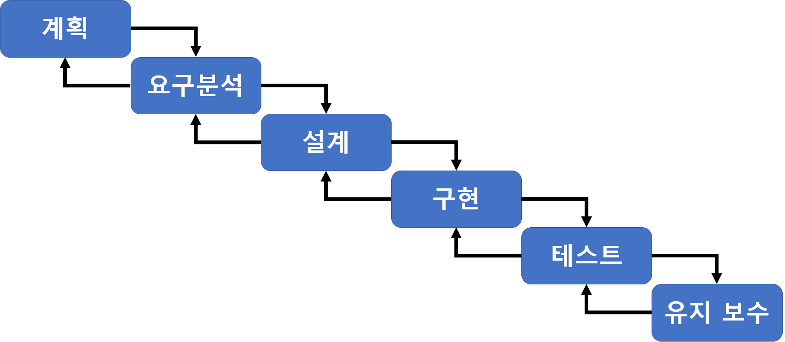

# CI/CD

 

### 정의, CI/CD란 무엇인가?

* 애플리케이션 개발 단계를 자동화하여 보다 짧은 주기로 고객에게 제공하는 방법이다.
* CI/CD의 기본 개념은 **지속적인 통합**, **지속적인 서비스의 제공**, 그리고 **지속적인 `배포`**를 포함한다.
* 즉, 새로운 코드의 변경 사항이 통합될 때 개발 운영팀에 발생하는 문제를 해결하기 위한 솔루션이다.
* 쉽고 간단하게 한 문장으로 표현한다면...
  * **개발 - 빌드 - 테스트 - 배포 까지의 전 과정을 자동화 하는 것이 CI/CD의 핵심 개념이다.**

 

### CI와 CD의 차이점?

#### CI

* 개발자를 위한 자동화 프로세스인 지속적인 통합(Continuous Integration)을 의미한다.
* 이 CI 과정을 성공적으로 구현할 경우, 코드 변경 사항이 정기적으로 `빌드` 및 `테스트` 되어서 공유 레포지토리에 통합된다.
* 이 때, 다수의 개발자가 동시에 코드 수정을 진행할 경우 작업이 충돌할 수 있는 문제에 대해 해결 가능하다.
* 쉽고 간단하게 한 문장으로 표현한다면...
  * **다수의 개발자가 추가 및 수정한 코드를 지속적으로 통합 및 테스트하는 것을 말한다.**

 

#### 지속적 통합

* 하나의 프로젝트에 대해 여러 사람이 다른 기능을 구현하는 상황을 가정한다.
* 이 조직에서 병합(merge)하는 특정 날짜를 정하고 모든 분기의 코드를 병합한다고 하자.
* 그러면 반복적인 수작업을 통해 너무 많은 시간과 에너지를 소모하게 된다.
* 특히 클라우드 기반의 IDE를 사용할 때 각자 로컬 저장소를 커스터마이징 하는 경우, 더더욱 복잡한 문제가 될 수 있다.
* 따라서 CI를 통해 개발자들은 

 

#### CD

* 지속적인 서비스 제공(Continuous Delivery) 및 지속적인 배포(Continuouse Deployment)를 의미한다.
* 두 가지 의미 모두 파이프라인의 추가 단계에 대한 자동화를 뜻하지만, 때로 얼마나 많은 자동화가 이루어지고 있는지 설명하기 위해 사용되기도 한다.
* 쉽고 간단하게 한 문장으로 표현한다면...
  * **개발, 통합, 테스트, 배포, 릴리즈의 과정을 자동화하여 지속적으로 배포하는 것을 말한다.**

 

#### 지속적 제공

* 지속적 제공이란, 개발자들이 앱에 적용한 변경 사항이 버그 테스트를 거쳐서 레포지토리에 자동으로 업로드 되는 것을 의미한다.
* 운영팀은 이 레포지토리에서 애플리케이션을 바로 `프로덕션 환경`으로 배포할 수 있다.
* 이 과정은 서로 다른 팀들간의 부족한 소통 문제 및 가시성 문제를 해결해 준다.
* 지속적인 제공은, 최소한의 노력으로 새로운 코드를 배포하는 것을 목표로 한다.

 

#### 지속적 배포

* 개발자의 변경 사항을 레포지토리에서 고객이 사용 가능한 `프로덕션 환경`까지 자동으로 `릴리스` 하는 것을 의미한다.
* 자동이 아닌 수동으로 해당 프로세스를 진행할 경우, 애플리케이션을 제공하는 속도를 낮출 뿐 아니라, 같은 과정을 반복해서 수행하는 비효율적인 문제, 과부하 문제가 생길 수 있다.
* 지속적인 배포는, 파이프라인의 다음 단계를 자동화함으로 지속적인 제공이 가진 장점을 활용한다.

 

 

 

### 장점

 

### 기법의 종류(?) 모델(?)

#### 폭포수 모델

 

#### 애자일 모델

으어 이것도 이미지 만들자.

* 오늘날 개발하는 환경 및 문화는 혼자서 프로젝트를 모두 맡아 개발하는 경우도 간혹 있지만, 각 다른 기능을 동시에 작업할 수 있도록 협업을 기반으로 하는 경우가 대부분이다.!!!

 

 

#### Ref

[CI/CD 개념, 방법, 장점, 구현과정](https://www.redhat.com/ko/topics/devops/what-is-ci-cd)

[CI/CD 개발 방법론](https://pepgotesting.com/continuous-integration/)

[CI/CD 의 개념, 적용해본 후기](https://deveric.tistory.com/106)

[개발부터 배포까지 자동화](https://minz.dev/18)

[CI/CD Tool 비교](https://medium.com/day34/ci-cd-tool-comparison-f710a4777852)

[CI/CD Tool 비교2](https://velog.io/@hanblueblue/CICD-%ED%88%B4-%EB%B9%84%EA%B5%90)

#### 용어 및 추가로 알아볼 것

* [배포, 릴리즈](https://opentutorials.org/course/1724/9836)
* https://opentutorials.org/course/1724/9836
* 빌드
* 테스트
* 파이프라인
* ['프로덕션 환경' 을 포함한 개발 과정에서의 환경에 대한 용어 개념](https://bcho.tistory.com/759)
* 젠킨스
* [클라우드 네이티브 애플리케이션 개발](https://www.redhat.com/ko/topics/cloud-native-apps)

